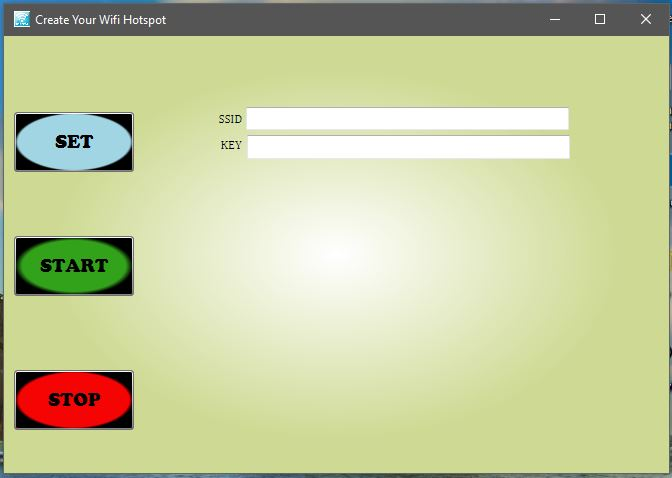

#Create-your-wifi-hotspot-windows-application

WPF appliaction developed on visual-studio and c# for creating hostednetwork connection on windows OS which have a wifi adapter.

Notes:
  1. Switch on your wifi first.
  2. This application donot install drivers for your wifi adapter
